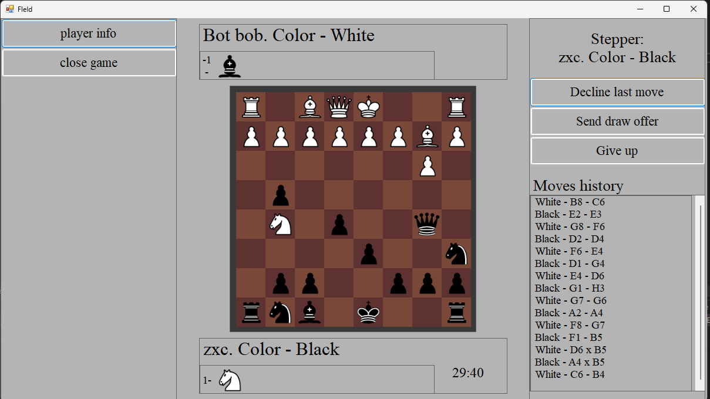

# ChessDiploma

A chess game built with C# and WinForms as a bachelor's diploma project. Supports both local multiplayer and games against an AI opponent.



## Features

**Game Modes**
- Player vs Player (local)
- Player vs AI — 3 difficulty levels (Easy / Medium / Hard), each looks ahead a different number of moves using heuristic evaluation

**Gameplay**
- Drag & drop pieces
- Move highlighting — all legal moves shown on selection
- Move history — full game notation recorded during play
- Move replay — scroll back through previous moves
- Captured pieces panel
- Draw and resignation offers

**Players & Stats**
- Player profiles with rating system
- Rating updates after each game

**UI**
- Piece color selection
- Game timer

## Stack

- **C# / WinForms** — UI and logic
- **ADO.NET** — data access
- **SQL Server + SSMS** — database

## Project Structure

```
ChessLib/     # chess engine — move generation, AI, heuristics
Models/       # data models, player/game entities
Windows/      # WinForms windows and UI logic
Images/       # piece and board assets
```

## Getting Started

1. Clone the repo and open `ChessDiploma.sln` in Visual Studio
2. Set up the database in SSMS and update the connection string in `App.config`
3. Restore NuGet packages
4. Hit F5
